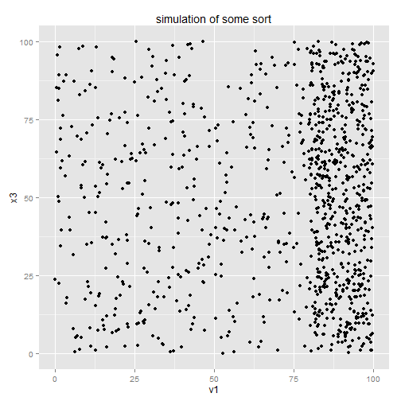
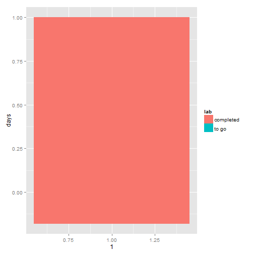

Web Scraping part 2: Digging in
========================================================
width: 1200
author: Rolf Fredheim and Aiora Zabala
date: University of Cambridge
font-family: 'Rockwell'
25/02/2014

Today we will:
========================================================

- Become good at writing bad* functions
- Learn how to access information in web-pages (HTML, XML, etc)

Get the docs:
http://fredheir.github.io/WebScraping/Lecture2/p2.html

https://raw.github.com/fredheir/WebScraping/master/Lecture2/p2.Rpres

http://fredheir.github.io/WebScraping/Lecture2/p2.R


<br>
<br>
<br>
<small> *mabye 'utilitarian', 'expedient', and 'functional' would be more accurate, if more pompous descriptions of this practice</small>

Digital data collection
=======================

- Devise a means of accessing data
- Retrieve that data
- tabulate and store the data

Last week step two involved JSON. 

Today we work with HTML. 

Steps 1 and 3 do not change the same

Revisiting the programming basics
================
type:section

Good functions
========================================================

What makes a function good?
- Clear name
- Instructions to user
- Short
- Performs a single task
- Is efficient
- Can handle errors
- Is predictable
- Does not use **global variables** (someone explain?)

Bad functions
========================================================

... break the rules/ guidelines above. But they can be useful to:
- hide a script behind a function
- get overview
- move on to the next task
- don't worry about methods and error handling: simplifies the process

If writing functions for your own use, it's ok* to write bad functions. 

<small>*But basic notes throughout the code reminding yourself what you did will be invaluable</small>

Revision
============
What is a variable?

What are they for?


Variables
=================
type:sq
Two main purposes:

quicker to write

```r
uni= "The University of Cambridge"
uni
```

```
[1] "The University of Cambridge"
```
***
quicker to change the code. It is good practice to declare variables near the start of your code

Paying tax:
9400 tax free

```r
(20000-9440)*20/100
```

```
[1] 2112
```

```r
#OR:
wage=20000
taxFree=9400
rate=20
(wage-taxFree)*rate/100
```

```
[1] 2120
```


Functions without variables
================


```r
printName <- function(){
  print ("My name is Rolf Fredheim")
}

printName()
```

```
[1] "My name is Rolf Fredheim"
```

This is a useless function. But sometimes, if we have many lines of code requiring no particular input, it can be useful to file them away like this.

e.g. for simulations
============

```r
sillySimulation <- function(){
x1 <- runif(500,80,100)
x2 <- runif(500,0,100)
v1 <- c(x1,x2)

x3 <- runif(1000,0,100)

df <- data.frame(v1,x3)
require(ggplot2)

print(ggplot(df, aes(v1,x3))+geom_point()+ggtitle("simulation of some sort"))
}
```


=====
Just as this slide hides the code on the previous slide, so the function hides the underlying code. 

```r
sillySimulation()
```

 

Inserting variables
=========
Let's hammer home how to use variables

what variables could we add to the function below?

```r
desperateTimes <- function(){
  print(paste0("Rolf is struggling to finish his PhD on time. Time remaining: 6 months"))
}
```


Name
===========


```r
desperateTimes <- function(name){
  print(paste0(name ," is struggling to finish his PhD on time. Time remaining: 6 months"))
}
desperateTimes(name="Tom")
```

```
[1] "Tom is struggling to finish his PhD on time. Time remaining: 6 months"
```

Gender
===========
type:sq
we specify a default value

```r
desperateTimes <- function(name,gender="m"){
  if(gender=="m"){
    pronoun="his"
  }else{
    pronoun="her"
  }
  
  print(paste0(name ," is struggling to finish ",pronoun," PhD on time. Time remaining: 6 months"))
}
desperateTimes(name="Tanya",gender="f")
```

```
[1] "Tanya is struggling to finish her PhD on time. Time remaining: 6 months"
```
Is this a good function? Why (not)?

degree
==============

```r
desperateTimes <- function(name,gender="m",degree){
  if(gender=="m"){
    pronoun="his"
  }else{
    pronoun="her"
  }
  
  print(paste0(name ," is struggling to finish ",pronoun," ",degree," on time. Time remaining: 6 months"))
}
desperateTimes(name="Rolf",gender="m","Mphil")
```

```
[1] "Rolf is struggling to finish his Mphil on time. Time remaining: 6 months"
```


Days til deadline
============
type:sq1

```r
require(lubridate)
require(ggplot2)
deadline=as.Date("2014-09-01")
daysLeft <- deadline-Sys.Date()
totDays <- deadline-as.Date("2011-10-01")
print(daysLeft)
```

```
Time difference of -193 days
```

```r
print(paste0("Rolf is struggling to finish his PhD on time. Days remaining: ", as.numeric(daysLeft)))
```

```
[1] "Rolf is struggling to finish his PhD on time. Days remaining: -193"
```
part2
==========
type:sq

```r
print(paste0("Percentage to go: ",round(as.numeric(daysLeft)/as.numeric(totDays)*100)))
```

```
[1] "Percentage to go: -18"
```

```r
df <- data.frame(days=c(daysLeft,totDays-daysLeft),lab=c("to go","completed"))
ggplot(df,aes(1,days,fill=lab))+geom_bar(stat="identity",position="fill")
```

 


===========
type:sq1

We could put all this code in a function, and forget about it

```r
timeToWorry <- function(){
  require(lubridate)
  deadline=as.Date("2014-09-01")
  daysLeft <- deadline-Sys.Date()
  totDays <- deadline-as.Date("2011-10-01")
  print(daysLeft)
  print(paste0("Rolf is struggling to finish his PhD on time. Days remaining: ", as.numeric(daysLeft)))
  print(paste0("Percentage to go: ",round(as.numeric(daysLeft)/as.numeric(totDays)*100)))
  df <- data.frame(days=c(daysLeft,totDays-daysLeft),lab=c("to go","completed"))
  ggplot(df,aes(1,days,fill=lab))+geom_bar(stat="identity",position="fill")
}
```

File it away until in need of a reminder
======

```r
timeToWorry()
```

```
Time difference of -193 days
[1] "Rolf is struggling to finish his PhD on time. Days remaining: -193"
[1] "Percentage to go: -18"
```

 


Finishing up last week's material
=============================
type:section


What does this have to do with webscraping?
============
Bad functions like this will help us to break the task into bitesize chunks

Rather than working with long unruly scripts, we write a little script that works, identify any necessary variables, and file it away. A typical structure might be:

- Load packages, set working directory
- Download one example
- Extract the necessary information
- Store the information
- Repeat.

-> either by looping, or by completing one step at a time


Last week's code
=================
type:sq
example and explanation

downloading data
Check the code is correct


```
Error in eval(expr, envir, enclos) : could not find function "fromJSON"
```
